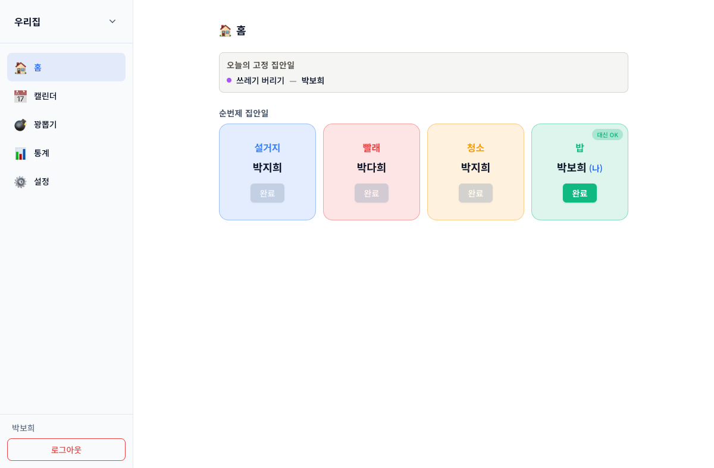
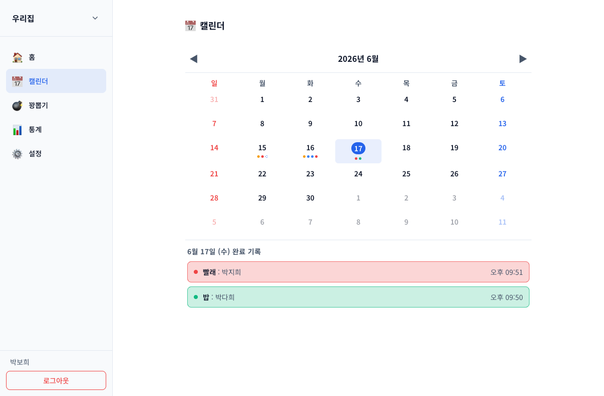
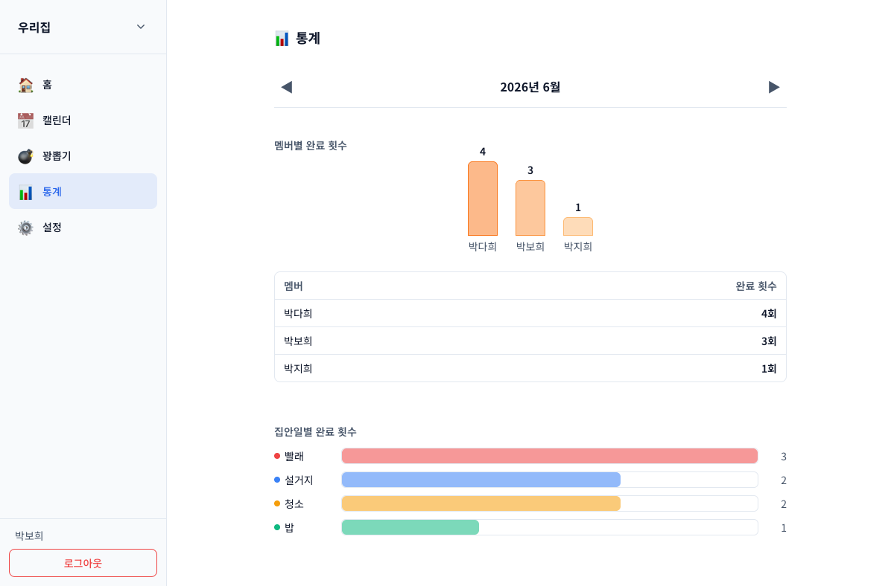
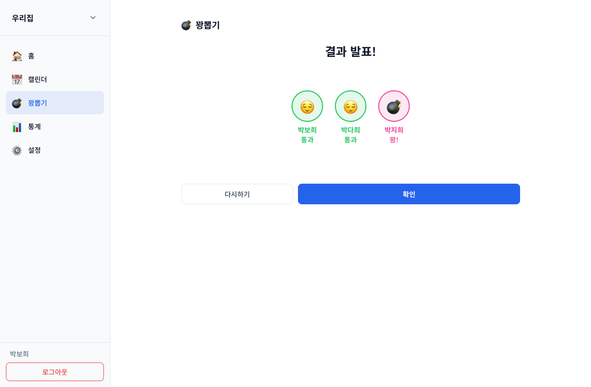

# 우리집 살림 매니저

> 셰어하우스·가족·기숙사 룸메이트를 위한 집안일 분담 · 순번 회전 · 통계 시각화 웹 애플리케이션

**Live**: <https://smwu-housework-manager.vercel.app>
**과목**: 숙명여자대학교 웹시스템설계 기말 프로젝트 (2026 봄학기)
**작성자**: 박보희 / 2313731

---

## 한 줄 설명

같이 사는 사람들이 누가 무엇을 얼마나 했는지 자동으로 누적하고, 차례를 회전시키고, 멤버별 분담 비율을 차트로 보여주는 모바일 우선 PWA.

## 스크린샷

| 홈 (대시보드) | 캘린더 |
|---|---|
|  |  |
| **통계** | **꽝뽑기 결과** |
|  |  |

## 주요 기능

| 기능 | 설명 |
|---|---|
| **그룹 관리** | 다대다 멤버십(한 계정이 여러 그룹), 6자 초대 코드, 방장 권한 |
| **순번제 집안일** | `rotationOrder` + `currentTurnIndex` 자동 회전, 차례 멤버만 완료 활성 |
| **고정제 집안일** | weekly(요일) / interval(N일 주기) 스케줄, 알림만 (기록 없음) |
| **대신 완료** | `allowProxyComplete` 옵션, 통계 귀속과 실제 누른 사람 분리 |
| **차례 복원** | 방장이 잘못된 기록 비활성화 시 순번 자동 복원 (idempotent 거울 동작) |
| **월별 캘린더** | 색상 점으로 완료 표시 + 셀 클릭 상세 다이얼로그 |
| **멤버·집안일 통계** | 월 단위 div+CSS 차트, 외부 차트 라이브러리 0개 |
| **꽝뽑기** | Fisher–Yates 셔플 즉석 추첨, 휘발성 (기록 미생성) |

## 기술 스택

| 영역 | 기술 | 버전 |
|---|---|---|
| 언어 | TypeScript (Strict) | 5.x |
| 프레임워크 | Next.js (App Router) | 16.2.6 |
| UI | React | 19.2.4 |
| 스타일 | Tailwind CSS | 4.x |
| 폰트 | Noto Sans KR | — |
| 인증 | Firebase Auth | 12.14 |
| DB | Firebase Firestore (NoSQL) | 12.14 |
| 권한 | Firestore Security Rules | — |
| 테스트 | Vitest + @firebase/rules-unit-testing | 4.x / 5.x |
| 에뮬레이터 | firebase-tools | 13.35 |
| 배포 | Vercel | — |

**아키텍처 특징** — 백엔드 0줄. API Route를 작성하지 않고 클라이언트가 Firestore SDK로 직접 read/write, 권한 검증은 전부 Security Rules에 위임한다.

## 데이터 모델 (Firestore 5개 컬렉션)

```
users/{uid}              — 계정 + groupIds[]
groups/{groupId}         — 그룹 + memberUids[] + memberNames 캐시 + inviteCode
chores/{choreId}         — 집안일 + mode(rotation|fixed) + rotationOrder + currentTurnIndex
choreLog/{logId}         — 완료 기록 + completedBy(통계) + completedByActual(실제)
inviteCodes/{code}       — code → groupId lookup
```

상세 스키마는 [`docs/superpowers/specs/2026-03-31-house-chore-manager-design.md`](docs/superpowers/specs/2026-03-31-house-chore-manager-design.md) 참조.

## 핵심 불변식 (Invariant)

1. `users.{uid}.groupIds[]` ↔ `groups.{gid}.memberUids[]` 양방향 동기화
2. 순번제 완료 시 `currentTurnIndex = (idx + 1) % rotationOrder.length`
3. 방장 비활성화 시 순번제는 `currentTurnIndex` 자동 -1 (mod 적용)
4. 통계 집계는 `active: true`만, 캘린더 표시는 비활성화 항목도 유지
5. 고정제는 `choreLog` 미생성 — 알림만, 통계·캘린더 제외
6. 꽝뽑기는 휘발성 — 어디에도 기록되지 않음

## 폴더 구조

```
src/
├── app/
│   ├── (public)/{login,signup}          # 비인증 영역
│   └── (protected)/
│       ├── (shell)/{,calendar,chores,random,stats,settings}
│       └── groups/{new,join}            # 그룹 온보딩
├── components/{chore,group,nav,random,stats}
├── lib/
│   ├── firebase/{client,converters,errors}
│   ├── chore/{rotation,fixed-schedule,stats,random,operations}    # pure
│   ├── group/{invite-code,operations}
│   ├── hooks/                            # useAuth, useChores, useChoreLog ...
│   ├── providers/                        # AuthProvider, ActiveGroupProvider
│   └── types/
tests/                                    # Vitest 약 120 케이스
firestore.rules                           # Security Rules
docs/
├── superpowers/specs/...md               # SSOT 설계
├── security-rules-matrix.md              # 권한 매트릭스
└── report/                               # 기말 보고서 (.md + .docx)
```

## 로컬 개발

### 1. 의존성 설치

```bash
npm install
```

### 2. Firebase 환경변수 설정

`.env.local.example`을 복사해 Firebase Console 값 6개를 채운다.

```bash
cp .env.local.example .env.local
```

`Firebase Console → 프로젝트 설정 → 내 앱 → SDK 설정 및 구성`에서 값을 가져온다.

### 3. 개발 서버 실행

```bash
npm run dev      # http://localhost:3000 (Turbopack)
```

## 명령어

| 명령 | 동작 |
|---|---|
| `npm run dev` | 개발 서버 (Turbopack) |
| `npm run build` | 프로덕션 빌드 |
| `npm run lint` | ESLint |
| `npm run emulators` | Firebase Auth + Firestore 에뮬레이터 기동 |
| `npm run emulators:ui` | 에뮬레이터 + 웹 UI 동시 기동 |
| `npm run test:rules` | 에뮬레이터 + Vitest 일괄 실행 (Rules + 단위 테스트) |

## 테스트

| 파일 | 케이스 | 검증 대상 |
|---|---|---|
| `tests/rules.test.ts` | 38 | Firestore Security Rules |
| `tests/rotation.test.ts` | 25 | 순번 진행·복원·완료 권한 |
| `tests/fixed-schedule.test.ts` | 25 | weekly·interval 스케줄 계산 |
| `tests/stats.test.ts` | 14 | 월 단위 집계 |
| `tests/random.test.ts` | 9 | Fisher–Yates 셔플 |
| `tests/invite-code.test.ts` | 9 | 6자 코드 생성·검증 |

총 약 120 케이스. emulator 자동 기동은 `npm run test:rules` 한 명령으로 처리된다.

## 배포

main 브랜치 push → Vercel 자동 배포.

- Production: <https://smwu-housework-manager.vercel.app>
- 환경변수 6개를 Vercel Settings → Environment Variables 에 등록 필요.

## 문서

| 문서 | 용도 |
|---|---|
| [`docs/superpowers/specs/...md`](docs/superpowers/specs/2026-03-31-house-chore-manager-design.md) | 단일 진실 공급원 (SSOT) — 데이터 모델·페이지 구성 정의 |
| [`docs/security-rules-matrix.md`](docs/security-rules-matrix.md) | Firestore Rules 권한 매트릭스 |
| [`docs/superpowers/wireframes/wireframe-interactive.html`](docs/superpowers/wireframes/wireframe-interactive.html) | 확정 와이어프레임 |
| [`docs/proposal/우리집-살림-매니저-제안서.md`](docs/proposal/우리집-살림-매니저-제안서.md) | 제안서 |
| [`CLAUDE.md`](CLAUDE.md) | 프로젝트 컨벤션 + 핵심 불변식 |

## 개발 일정

| 주차 | 단계 | 산출물 |
|---|---|---|
| 1주차 | 기반 셋업 + 인증·그룹 | AuthProvider, ActiveGroupProvider, 그룹 CRUD |
| 2주차 | 집안일 CRUD + 캘린더 | rotation 엔진, fixed-schedule, 월별 캘린더, LogDetailDialog |
| 3주차 | 통계·꽝뽑기 + 반응형 점검 + 배포 | div+CSS 차트, Fisher–Yates, Vercel 배포 |

## AI 도구

본 프로젝트는 **Claude Code (Anthropic, Opus 4.7)** 를 활용해 설계·구현·리팩토링·문서화 전 단계를 진행했다. 사람의 역할은 UX 결정·비즈니스 불변식 정의·우선순위 판단·최종 의사 결정에 있다.

## 라이선스

본 프로젝트는 숙명여자대학교 웹시스템설계 기말 프로젝트 과제물이며, 별도 라이선스 미부여. 학습 목적 참고는 자유롭게 가능.
