# 우리집 살림 매니저 — 프로젝트 제안서

> 웹시스템설계 기말 프로젝트 제안서
> 작성일: 2026-05-24

---

## 목차

1. **프로젝트 개요** — 서비스 정의·대상·핵심 가치
2. **문제 정의 / 대상 사용자** — 공동 거주 분담 갈등, 페르소나
3. **시장 및 유사 서비스 분석** — 경쟁 서비스 비교, 차별성(Positioning)
4. **요구사항 분석** — 기능/비기능 요구사항, MoSCoW, 강의 필수요건 매핑
5. **주요 기능 설명** — 그룹·집안일(순번제/고정제)·완료 체크·비활성화·꽝뽑기·캘린더·통계·네비게이션
6. **화면 설계** — 화면설계서 13종(와이어프레임 + Description)
7. **기술 스택 및 시스템 구조** — 기술 선택, 3-Tier 구조, 데이터 모델
8. **개발 일정** — 3주 집중 일정, 중간 점검
- **부록** — AI 활용 계획

---

## 1. 프로젝트 개요

**우리집 살림 매니저**는 함께 사는 사람들이 집안일 당번을 확인하고 완료를 기록하는 반응형 웹 애플리케이션이다.

| 항목 | 내용 |
|------|------|
| 서비스명 | 우리집 살림 매니저 |
| 한 줄 정의 | 공동 거주 구성원의 집안일 당번·완료 기록을 관리하는 웹앱 |
| 대상 사용자 | 함께 거주하는 2~N명 (룸메이트·가족·셰어하우스 등) |
| 핵심 가치 | "지금 누구 차례인가"를 다툼 없이 한눈에 + 기여도를 데이터로 가시화 |
| 플랫폼 | 모바일 우선 반응형 웹 (PC 사이드바 / 모바일 하단 탭) |

기존에는 가족 캘린더 앱에 "OO 설거지", "OO 빨래"처럼 **수동으로 적던 방식**을 사용했다. 이 앱은 순번 자동 진행·완료 기록·통계·랜덤 배정을 갖춘 **전용 도구**로 그 방식을 대체한다. 특정 가정에 고정되지 않고 멤버 이름·집안일·색상을 그룹이 직접 정의하는 **범용 서비스**로 설계한다.

---

## 2. 문제 정의 / 대상 사용자

### 2.1 문제 정의

공동 거주에서 집안일 분담은 사소하지만 반복적인 갈등의 원인이다.

- **"누가 할 차례인지" 불명확** — 구두 약속이나 기억에 의존해 책임 소재가 흐려진다.
- **수동 기록의 한계** — 캘린더·메신저에 손으로 적는 방식은 순번 자동 진행·집계가 안 되고, 누락·중복이 잦다.
- **기여도 불투명** — 한 달간 누가 얼마나 했는지 객관적 수치가 없어 "나만 한다"는 불만이 쌓인다.
- **돌발 집안일 배정의 비효율** — 갑자기 생긴 일(심부름 등)을 정할 공정한 방법이 없다.

> 핵심 질문 — ① 어떤 불편함이 있는가: 차례·기여도가 불투명. ② 왜 생기는가: 자동 기록·집계 수단 부재. ③ 해결 시 가치: 분담 갈등 감소 + 공정성 가시화.

### 2.2 대상 사용자 (Persona)

| 페르소나 | 상황 | 니즈 |
|----------|------|------|
| **공유 룸메이트 (20대)** | 셰어하우스 3인, 생활 패턴 제각각 | 차례 자동 안내, 안 한 사람 확인 |
| **가족 구성원 (자매 3인)** | 기존에 캘린더로 수기 관리 | 수기 대체, 월별 기여도 통계 |
| **방장(그룹 관리자)** | 분담 규칙·멤버 관리 책임 | 멤버 초대/관리, 규칙 위반 기록 비활성화 |

---

## 3. 시장 및 유사 서비스 분석

### 3.1 경쟁 / 유사 서비스

| 서비스 | 분류 | 장점 | 한계 |
|--------|------|------|------|
| **Tody / 집안일 체크앱** | 청소 관리 앱 | 주기 기반 청소 알림 | 개인용 중심, 공동 순번·기여도 비교 약함 |
| **가족 공유 캘린더** (구글/네이버) | 일반 캘린더 | 익숙함, 일정 공유 | 순번 자동 진행·완료 집계·랜덤 배정 없음 |
| **카카오톡 / 메신저 공지** | 메신저 | 진입장벽 0 | 기록 휘발, 통계 불가, 책임 추적 불가 |
| **종이 당번표 / 화이트보드** | 아날로그 | 즉시성 | 원격 확인 불가, 데이터화 불가 |

### 3.2 차별성 (Positioning)

본 서비스는 "**공동 거주 전용 + 순번 자동화 + 기여도 통계**"의 교집합을 노린다.

- **순번제 자동 진행** — 완료 버튼 한 번에 다음 사람으로 자동 이행(경쟁 서비스 대부분 수동).
- **고정제 + 순번제 혼합** — 요일/주기 고정 담당과 순번 돌리기를 한 앱에서 동시 운용.
- **기여도 통계 + 캘린더** — 월별 멤버별/집안일별 완료 횟수를 수치·차트로 가시화.
- **꽝뽑기(랜덤 배정)** — 돌발 집안일을 공정하게 배정하는 차별 기능.
- **규칙 위반 관리** — 완료 기록 비활성화(사유 기록) + 순번 복원으로 공정성 담보.

---

## 4. 요구사항 분석

### 4.1 기능 요구사항 (시스템이 무엇을 해야 하는가)

| ID | 기능 | 설명 |
|----|------|------|
| FR-01 | 인증 | 이메일/비밀번호 회원가입·로그인 (Firebase Auth) |
| FR-02 | 그룹 관리 | 그룹 생성, 초대 코드 발급/합류, 멤버 강퇴(방장), 방장 위임, 다중 그룹 전환 |
| FR-03 | 집안일 CRUD | 프리셋 기반 생성 + 자유 추가/수정/삭제, 모드(순번제/고정제)·색상·규칙 설정 |
| FR-04 | 순번 완료 체크 | 현재 차례 멤버 완료 버튼 → 기록 저장 + 차례 자동 이행 |
| FR-05 | 완료 내역 비활성화 | 방장이 규칙 위반 기록을 사유와 함께 비활성화 + 순번 복원 |
| FR-06 | 꽝뽑기 | 참여 멤버 중 N명 랜덤 배정, 결과 기록 |
| FR-07 | 캘린더 뷰 | 월별 그리드에 완료 기록을 색상별 표시, 상세 팝업 |
| FR-08 | 통계 | 월별 멤버별/집안일별 완료 횟수 (표 + 차트) |

### 4.2 비기능 요구사항 (시스템이 어떻게 동작해야 하는가)

- **성능**: 주요 화면 3초 내 로딩, Firestore 실시간 리스너로 즉시 반영.
- **보안**: Firebase Auth 인증 + Firestore Security Rules로 그룹 멤버만 데이터 접근.
- **반응형**: Desktop(1280px+) / Tablet(768px) / Mobile(375px) 대응.
- **가용성**: 정적 호스팅 + 클라이언트-DB 직접 통신으로 단순·안정.

### 4.3 MoSCoW 우선순위

| 등급 | 기능 |
|------|------|
| **Must** | 인증, 그룹 관리, 집안일 CRUD, 순번 완료 체크, 캘린더 |
| **Should** | 통계, 완료 내역 비활성화, 꽝뽑기 |
| **Could** | 다크/라이트 토글, 초대 링크 공유, .ics 내보내기 |
| **Won't (이번 제외)** | 푸시 알림 서버, 구글 캘린더 양방향 동기화, AI 분담 추천 |

### 4.4 강의 필수요건 충족 매핑

| 필수요건 | 충족 방식 |
|----------|-----------|
| 최소 10개 화면 | 13개 화면 설계 (§6) |
| 입력 폼 1개 이상 | 회원가입·집안일 등록·비활성화 사유·꽝뽑기 설정 |
| CRUD 3개 이상 | 집안일 Create/Read/Update/Delete + 완료기록 Create/Update |
| 상태 관리 1개 이상 | 로그인 상태, 현재 그룹 선택, 캘린더 월/필터 |
| 데이터 저장 | Firebase Firestore (외부 저장) |
| 외부 API 연동 | Firebase Auth / Firestore SDK |
| 반응형 UI | 모바일 하단탭 ↔ PC 사이드바 |
| AI 활용 | 설계·코드 생성 과정에 Claude 활용, 기록 별도 관리 |
| 배포 | Vercel(또는 Firebase Hosting) 배포 |

---

## 5. 주요 기능 설명

### 5.1 그룹 관리

집안일 데이터의 단위는 **그룹**이다. 한 계정이 여러 그룹(예: "우리집", "자취방 친구들")에 동시에 속할 수 있고, 모든 화면(홈·캘린더·통계)은 **현재 선택된 그룹**의 데이터만 보여준다.

- **그룹 생성 / 방장**: 그룹을 만든 사람의 uid가 `ownerId`가 되고 `memberUids[]`에 자동 포함된다. 동시에 그 사용자의 `users.groupIds[]`에도 추가 — `groups.memberUids[]` ↔ `users.groupIds[]`를 **양방향 동기화**해 일관성을 유지한다.
- **초대 코드로 합류**: 영문 대문자 + 숫자 6자(예: `ABC123`), 혼동 문자(`0/O`, `1/I/L`)는 제외해 구두 전달 오류를 줄인다. 그룹당 1개를 유지하고 생성 시 기존 코드와 충돌하면 재생성. 유효 기간·사용 횟수 제한 없이 언제든 합류 가능. 코드 입력 → 그룹 검증 → 양방향 배열에 멤버 추가.
- **권한(방장 전용)**: 멤버 강퇴, 방장 위임(다른 멤버에게 `ownerId` 이전), 완료 내역 비활성화(§5.4)는 방장만 수행한다.
- **다중 그룹 전환**: 홈 상단 그룹명(▼) 탭 → 가입 그룹 목록 오버레이 → 선택 시 앱 전체의 데이터 컨텍스트가 해당 그룹으로 전환된다.

### 5.2 집안일 관리 — 순번제 / 고정제

집안일(chore)은 **순번제**와 **고정제** 두 모드로 나뉜다. 그룹마다 자유롭게 추가/수정/삭제한다.

- **프리셋 & 동적 추가**: 그룹 생성 직후 범용 프리셋을 체크박스로 제시한다. 선택 시 해당 그룹의 `chores` 컬렉션에 **복사본**으로 생성되므로(참조 아님), 이후 이름·모드·색상·순서·규칙을 그룹별로 독립 수정/삭제할 수 있다. **0개 선택(빈 화면에서 시작)도 허용**하며, "집안일 관리" 화면에서 언제든 추가 가능.
  - 순번제 후보: 설거지 · 빨래 · 거실 청소 · 방 청소 · 밥하기
  - 고정제 후보: 음식물쓰레기 비우기 · 일반쓰레기 배출 · 화장실 청소
- **순번제(`mode: "rotation"`)**: chore별로 참여 멤버와 순서를 독립 지정한다(예: 설거지는 언니→보희→동생, 화장실 청소는 언니·동생만). 정해진 주기가 없고 일이 쌓이면 차례인 사람이 수행. 완료 처리는 §5.3에서 상술. 핵심 필드: `rotationOrder[]`, `currentTurnIndex`, `allowProxyComplete`.
- **고정제(`mode: "fixed"`)**: 담당자별 스케줄을 지정하며 두 방식을 지원한다.
  - **요일 지정(`type: "weekly"`)**: 멤버별 담당 요일(예: 언니=월, 보희=수).
  - **주기 지정(`type: "interval"`)**: N일 주기 + 시작일(예: 2주마다, 시작 3/31). 오늘 담당 판정 = `floor((오늘 − startDate) / 1일) % intervalDays == 0`.
  - 고정제는 **완료 버튼·완료 기록이 없다.** 해당 날짜에 홈에서 "오늘 담당: 언니"처럼 알림만 표시하며, 캘린더·통계 집계 대상이 아니다.
- **완료 규칙(`rules[]`)**: 집안일별 약속(예: 설거지 → "음식물쓰레기 비우기")을 등록한다. 앱이 강제 체크하지 않는 **참고용 표시**다.
- **색상 팔레트(10색 고정)** — 집안일 등록 시 1색 선택, 캘린더 점·홈 카드·통계 막대에 동일 색 적용:
  `#4A90D9` `#E74C3C` `#2ECC71` `#F39C12` `#9B59B6` `#1ABC9C` `#E91E8C` `#34495E` `#95A5A6` `#F1C40F`

### 5.3 완료 체크 & 권한 (순번제)

완료 버튼은 **순번제 chore에만** 존재한다. 한 번 누르면 두 가지가 동시에 일어난다.

1. **기록 생성**: `choreLog`에 `{ type: "rotation", completedBy, completedByActual, completedAt, active: true }` 추가.
2. **차례 이행**: `currentTurnIndex = (currentTurnIndex + 1) % rotationOrder.length` — 완료 1회 = 차례 1회 소진, 즉시 다음 사람으로 넘어간다.

- **완료 권한**: 기본은 현재 차례 멤버(`rotationOrder[currentTurnIndex]`)에게만 버튼이 활성화되고, 나머지에게는 비활성/숨김.
- **대신 완료(`allowProxyComplete`, 기본 `false`)**: `true`이면 참여 멤버 누구나 대신 완료할 수 있다(차례 멤버 부재 시 커버 용도).
- **귀속 분리**: `completedBy` = 차례였던 멤버 uid(차례 소진·통계 귀속 대상), `completedByActual` = 실제 버튼을 누른 멤버 uid. `allowProxyComplete: false`이면 항상 둘이 동일하다. 통계(§5.7)는 `completedBy` 기준으로 집계한다.

### 5.4 완료 내역 비활성화

규칙을 지키지 않은 완료를 **방장**이 사후 처리하는 공정성 장치다.

- 방장이 완료 기록에서 **비활성화 사유를 입력(필수)** 후 확정. 기록은 **삭제하지 않고** `active: false`로 보존하며 `deactivatedBy`·`deactivatedAt`·`deactivateReason`을 남긴다(모든 멤버가 사유 확인 가능).
- **통계에서 제외**(active=true만 집계)되며, 순번제(`type: "rotation"`)였다면 **`currentTurnIndex`를 되돌려 차례를 복원**한다 — 비활성화로 소진됐던 차례를 다시 그 사람에게 돌려준다.
- 캘린더 뷰에서는 비활성화 기록도 **표시하되 취소선·딤 처리**로 구분한다.

### 5.5 꽝뽑기 (랜덤 배정)

순번에 없는 돌발 집안일(심부름 등)을 **공정하게 즉석 배정**하는 기능.

- 그룹 멤버 전원을 표시하고 체크박스로 참여/제외를 토글. 당첨 인원 수를 조정(기본 1명).
- "꽝뽑기" 버튼 → 참여 멤버 중 N명을 무작위 선택, 폭탄(💣) 아이콘 + 당첨자 이름으로 연출.
- 결과 확정 시 `choreLog`에 `type: "random"`으로 기록해 순번제 완료와 구분한다. 순번(`currentTurnIndex`) 진행에는 영향을 주지 않는다.

### 5.6 캘린더 뷰

- **앱 내 자체 캘린더**로 구현한다. Google Calendar 등 외부 API에 의존하지 않고, `choreLog.completedAt`을 기준으로 월별 그리드를 직접 렌더링한다(외부 연동/내보내기는 현재 범위 밖).
- 날짜별로 완료 기록(순번제·꽝뽑기)을 **집안일 색상 점(dot)**으로 표시하며, 하루에 여러 건이면 여러 점으로 누적 표현.
- 날짜/기록 클릭 → **상세 팝업**: 집안일 · 담당자(차례) · 실제 완료자 · 완료 시간 · 유형 · 상태(활성/비활성). 방장은 팝업에서 비활성화(§5.4) 진입.
- 비활성화 기록도 함께 표시하되 구분 가능하게(취소선·딤).

### 5.7 통계

- 현재 그룹의 이번 달 데이터를 **멤버별 완료 횟수**와 **집안일별 완료 횟수**로 집계한다.
- `completedBy` 기준, **`active: true`인 기록만** 집계(비활성화 건 제외, 고정제는 애초에 기록 없음).
- **숫자(표) + 차트(막대/파이)를 함께** 제공해 기여도를 한눈에 가시화한다.

### 5.8 네비게이션 / 사이트맵
모든 기능을 **2~3클릭 내 도달**하는 것을 설계 목표로 한다. 하단 탭(모바일)·사이드바(PC)에서 홈·캘린더·꽝뽑기·통계·설정에 바로 접근.

```
로그인 → 홈(1) → 캘린더(2) → 상세 팝업(3)
              → 집안일 관리(2) → 집안일 상세/편집(3)
              → 꽝뽑기(2) → 결과(3)
              → 통계(2)
              → 그룹 설정(2)
```

---

## 6. 화면 설계

> 화면설계서 표준 양식: 각 화면은 **화면 코드 / Page title / Screen Path** + 와이어프레임 + **Description** 으로 구성. 와이어프레임은 제작한 인터랙티브 프로토타입(`docs/superpowers/wireframes/wireframe-interactive.html`)을 **PC(데스크톱) 화면 기준 · 라이트 테마**로 캡처했다. **각 캡처 좌측의 번호(①②③…) 배지는 아래 Description 표의 번호와 1:1로 매칭**된다. 좌측 사이드바가 전역 네비게이션이며, 모바일에서는 하단 탭으로 전환되는 반응형 구조다.

### SCREEN-01 · 로그인 / 회원가입
- **Page title**: 로그인·회원가입 | **Screen Path**: 앱 진입 시 최초 화면

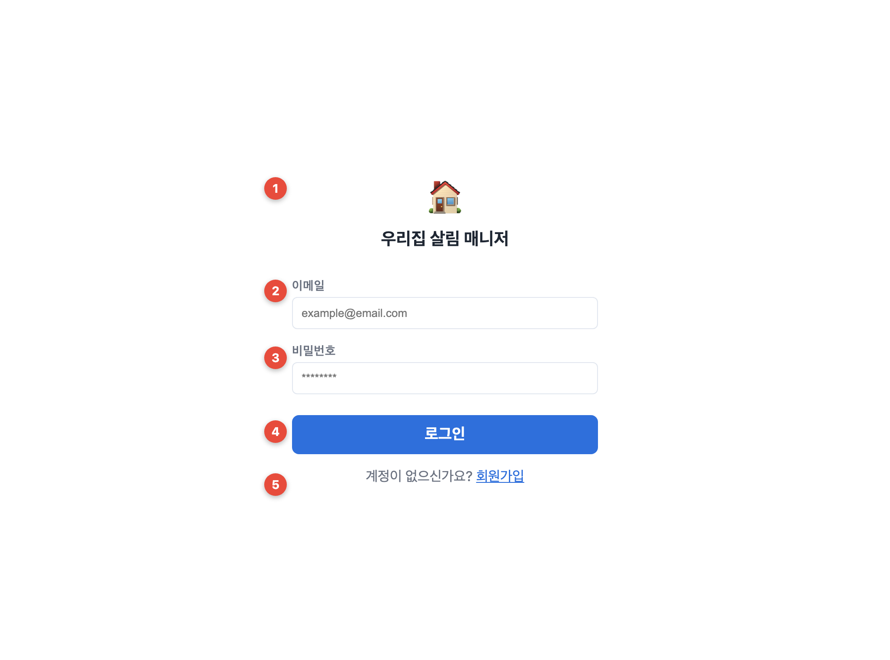

| # | Description |
|---|-------------|
| 1 | 서비스 로고(🏠)·명칭을 중앙 배치해 앱 정체성을 즉시 인지시키는 브랜드 영역 |
| 2 | 이메일 입력 — Firebase Auth 계정 식별자, `@` 형식 검증 후 진행 |
| 3 | 비밀번호 입력 — 마스킹(••) 처리, 최소 길이 검증 |
| 4 | 로그인 버튼 — 인증 성공 시 홈으로 라우팅, 실패 시 오류 메시지 노출 |
| 5 | 회원가입 전환 링크 — 이름·비밀번호 확인 필드가 추가된 가입 폼으로 토글 |

### SCREEN-02 · 홈 (대시보드)
- **Page title**: 홈 | **Screen Path**: 로그인 후 / 하단탭 '홈'

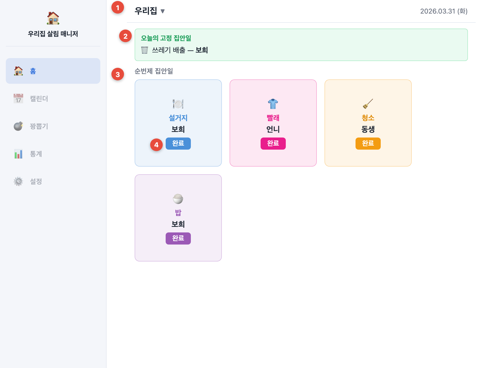

| # | Description |
|---|-------------|
| 1 | 상단 그룹 바 — 그룹명(▼) 탭 시 그룹 전환 오버레이 호출, 우측에 오늘 날짜 표시 |
| 2 | 오늘의 고정 집안일 알림 — 고정제 담당자 안내(완료 버튼 없음) |
| 3 | 순번제 카드 그리드 — 집안일별 이모지·색상·현재 차례 담당자 표시(PC 다열 / 모바일 2열) |
| 4 | 완료 버튼 — 차례 멤버가 1회 클릭 시 완료 기록 저장 + `currentTurnIndex`가 다음 멤버로 자동 +1 |

### SCREEN-03 · 그룹 전환 오버레이
- **Page title**: 그룹 선택 | **Screen Path**: 홈 상단 그룹명 탭

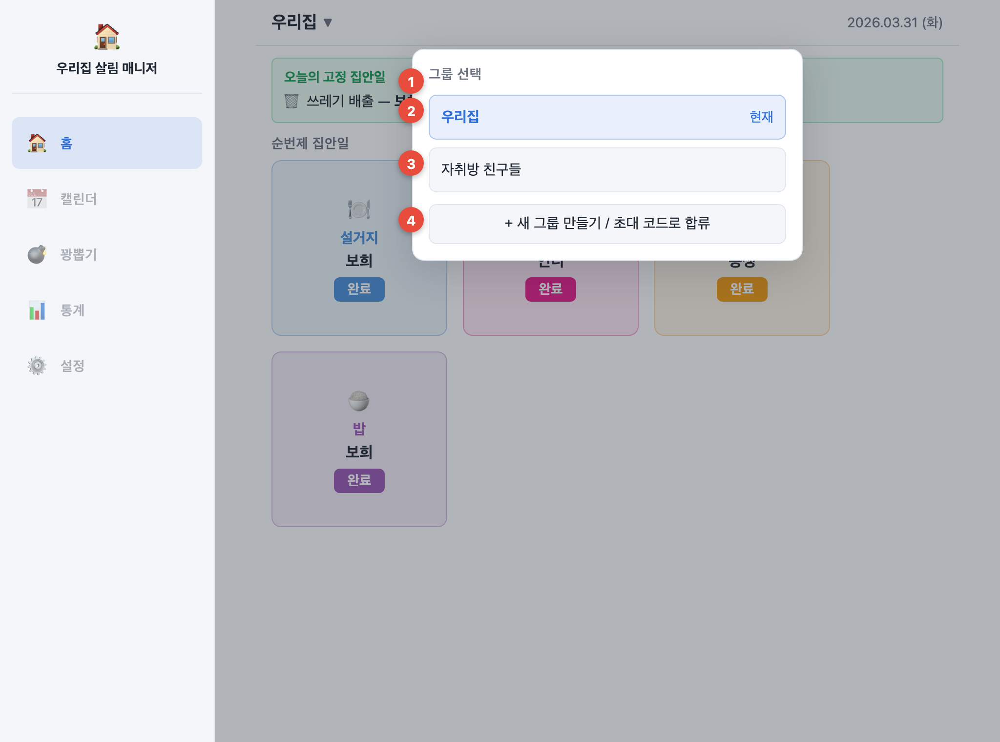

| # | Description |
|---|-------------|
| 1 | 오버레이 제목 — '그룹 선택', 배경 딤 처리로 포커스 집중 |
| 2 | 현재 그룹 — 활성 그룹을 '현재' 배지로 강조해 컨텍스트 식별 |
| 3 | 다른 가입 그룹 — 클릭 시 데이터 컨텍스트 전환(홈·캘린더·통계 모두 갱신) |
| 4 | 새 그룹 만들기 / 6자 초대 코드 합류 진입점 |

### SCREEN-04 · 캘린더
- **Page title**: 캘린더 | **Screen Path**: 하단탭 '캘린더'

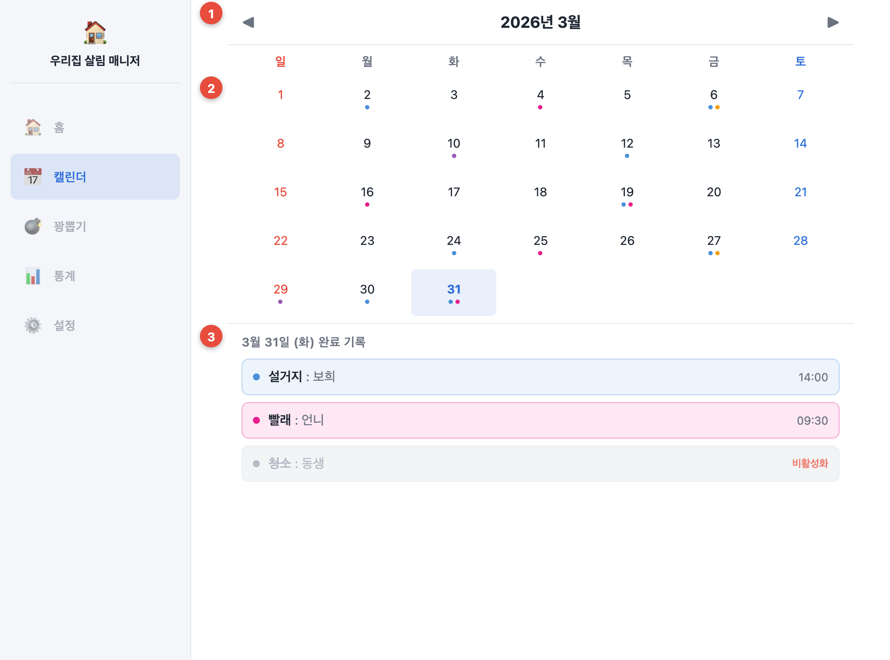

| # | Description |
|---|-------------|
| 1 | 월 이동 헤더 — ◀ ▶ 로 이전·다음 달 탐색, 중앙에 연·월 표시 |
| 2 | 월간 날짜 그리드 — 완료 기록을 집안일 색상 점(dot)으로 누적 표시(다건은 여러 점) |
| 3 | 선택일 완료 기록 — 색상·담당자·시간 나열, 비활성 건은 취소선·딤 처리. 클릭 시 상세 팝업(SCREEN-05) |

### SCREEN-05 · 완료 상세 팝업
- **Page title**: 완료 상세 | **Screen Path**: 캘린더 → 날짜/기록 클릭

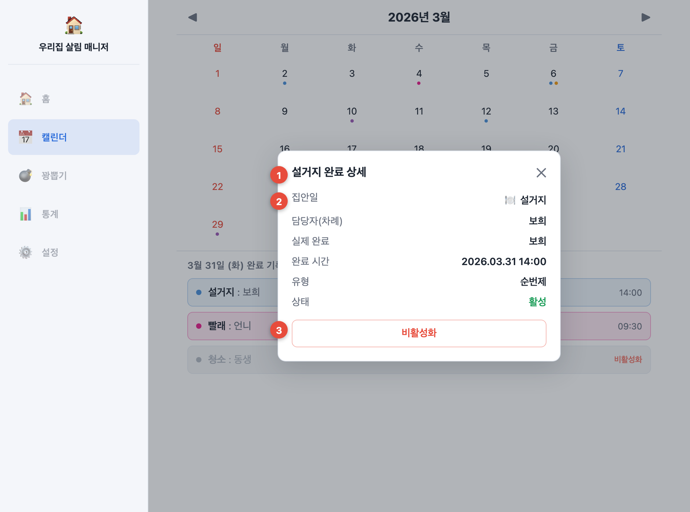

| # | Description |
|---|-------------|
| 1 | 팝업 헤더 — 대상 집안일명과 닫기(✕) |
| 2 | 상세 정보 — 집안일·담당자(차례)·실제 완료자·완료 시간·유형(순번/고정)·상태를 행으로 표시(담당자와 실제 완료자를 분리 표기) |
| 3 | 비활성화 진입 — 방장에게만 노출, 규칙 위반 기록 처리 폼으로 이동 |

### SCREEN-06 · 완료 내역 비활성화
- **Page title**: 비활성화 처리 | **Screen Path**: 완료 상세 팝업 → '비활성화'

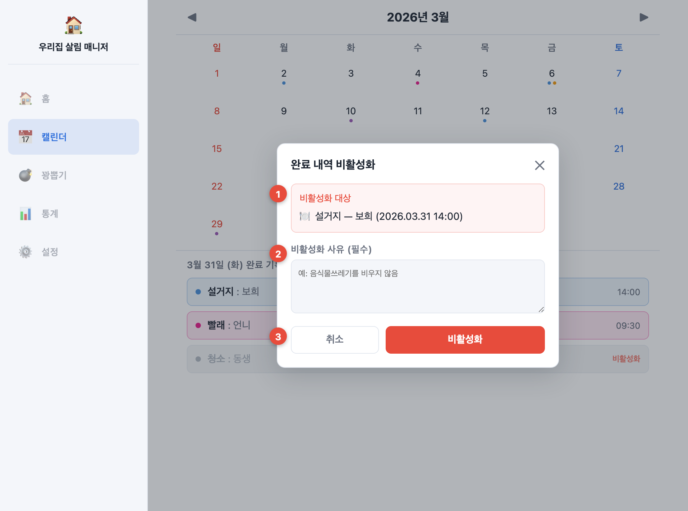

| # | Description |
|---|-------------|
| 1 | 비활성화 대상 — 처리할 완료 기록(집안일·담당자·시간)을 재확인 |
| 2 | 사유 입력 — 필수 입력, 미입력 시 확정 불가(공정성·추적성 확보) |
| 3 | 처리 버튼 — 확정 시 통계 집계 제외 + 소진된 순번 차례 복원 / '취소' 시 상세로 복귀 |

### SCREEN-07 · 집안일 관리
- **Page title**: 집안일 관리 | **Screen Path**: 설정 → 집안일 관리

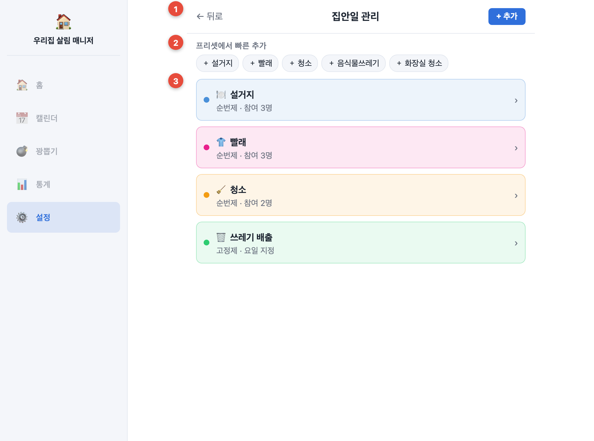

| # | Description |
|---|-------------|
| 1 | 헤더 — 뒤로·제목과 우측 '+ 추가'(신규 등록 진입) |
| 2 | 프리셋 빠른 추가 — 기본 항목을 칩 클릭으로 즉시 복사 생성(참조 아닌 복사 → 이후 독립 편집 가능) |
| 3 | 집안일 목록 — 색상 점·모드(순번/고정)·참여 인원과 함께 나열, 클릭 시 수정 화면 |

### SCREEN-08 · 집안일 추가 / 수정 (순번제)
- **Page title**: 집안일 편집 | **Screen Path**: 집안일 관리 → 추가/항목 클릭

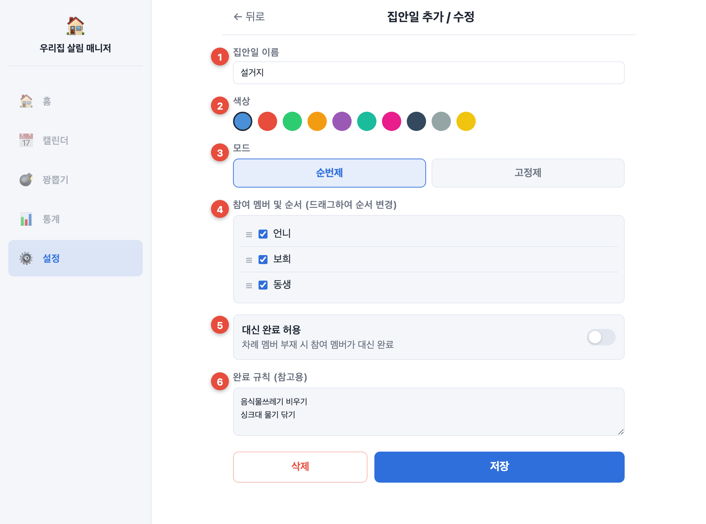

| # | Description |
|---|-------------|
| 1 | 집안일 이름 — 자유 입력(프리셋 복사 후 변경 가능) |
| 2 | 색상 — 10색 팔레트에서 선택, 캘린더 점·홈 카드·통계 막대에 동일 색 적용 |
| 3 | 모드 — 순번제/고정제 토글, 선택에 따라 하단 전용 설정이 전환 |
| 4 | 참여 멤버·순서 — 체크로 참여 지정, 드래그(☰)로 순번 순서 조정(`currentTurnIndex` 기준 순환) |
| 5 | 대신 완료 허용(`allowProxyComplete`) — 켜면 차례 멤버 부재 시 다른 참여 멤버가 대신 완료(담당자/실제 완료자 분리 기록) |
| 6 | 완료 규칙(참고용) — 완료 기준 메모, 멤버 간 합의 용도 |

### SCREEN-08B · 집안일 편집 — 고정제 스케줄
- **Page title**: 집안일 편집(고정제) | **Screen Path**: 집안일 편집 → 모드 '고정제' 선택

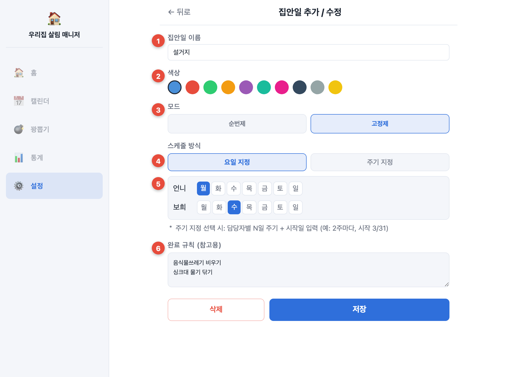

| # | Description |
|---|-------------|
| 1 | 집안일 이름 — 자유 입력 (공통) |
| 2 | 색상 — 10색 팔레트 선택 (공통) |
| 3 | 모드 — 고정제 선택 상태 |
| 4 | 스케줄 방식 — '요일 지정' / '주기 지정' 중 택1 |
| 5 | 담당자별 요일 — 멤버마다 담당 요일을 토글(요일 지정), 주기 지정 시 N일 주기 + 시작일(예: 2주마다, 시작 3/31) |
| 6 | 완료 규칙(참고용) — 고정제는 완료 버튼 없이 '오늘 담당' 알림만 제공하므로 규칙은 안내 용도 |

### SCREEN-09 · 꽝뽑기 설정
- **Page title**: 꽝뽑기 | **Screen Path**: 하단탭 '꽝뽑기'

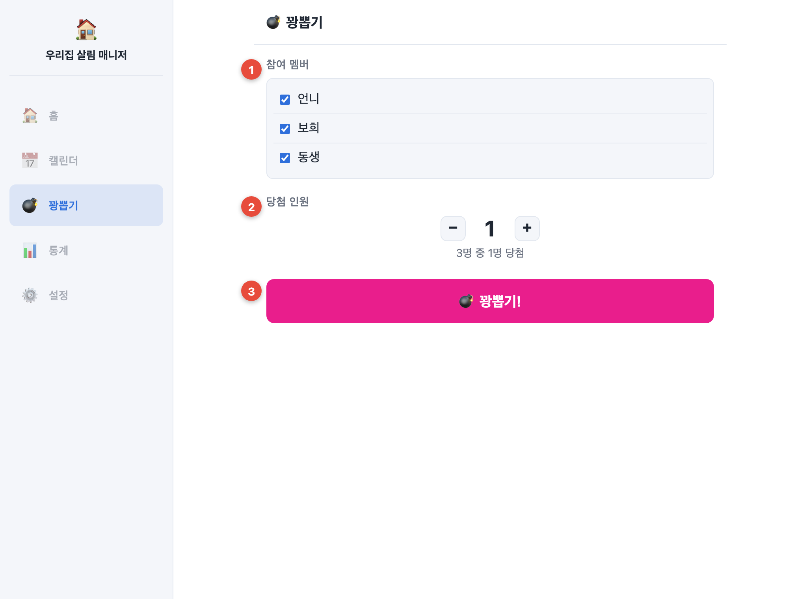

| # | Description |
|---|-------------|
| 1 | 참여 멤버 — 체크박스로 추첨 대상 포함/제외 |
| 2 | 당첨 인원 — −/+ 로 뽑을 인원 조정(기본 1명), 'N명 중 M명' 안내 |
| 3 | 꽝뽑기 버튼 — 클릭 시 참여자 중 무작위 배정 실행 |

### SCREEN-10 · 꽝뽑기 결과
- **Page title**: 꽝뽑기 결과 | **Screen Path**: 꽝뽑기 → 실행

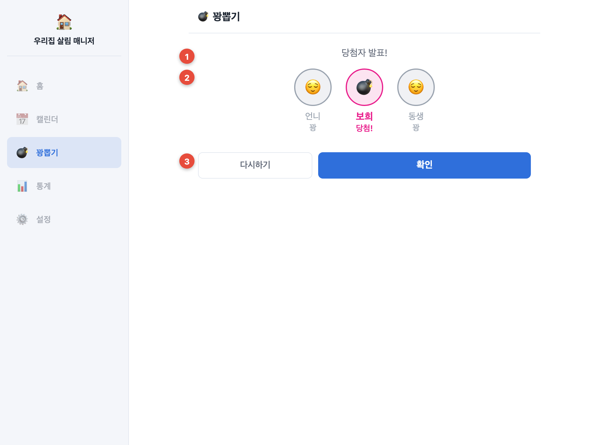

| # | Description |
|---|-------------|
| 1 | 발표 라벨 — 결과 연출 안내 |
| 2 | 결과 — 당첨자에 폭탄(💣) 강조, 미당첨은 딤 처리 |
| 3 | 액션 — '다시하기' 재추첨 / '확인' 시 `choreLog`에 random 유형으로 완료 기록 저장 |

### SCREEN-11 · 통계
- **Page title**: 통계 | **Screen Path**: 하단탭 '통계'

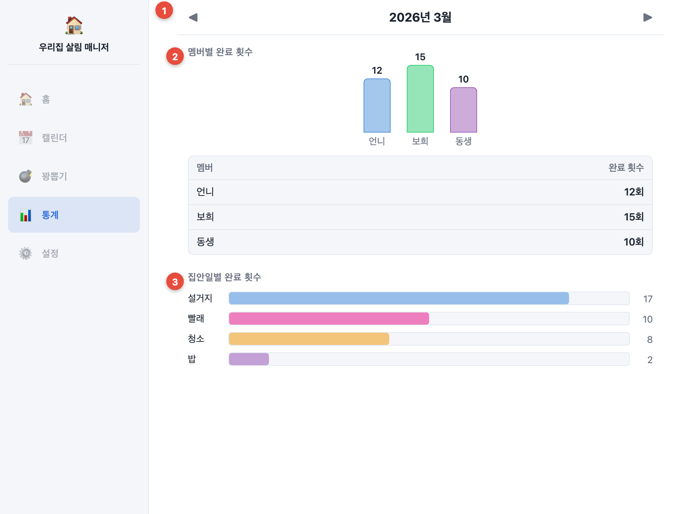

| # | Description |
|---|-------------|
| 1 | 월 이동 헤더 — 집계 대상 월 선택(◀ ▶) |
| 2 | 멤버별 완료 횟수 — 막대 차트 + 표로 기여도 가시화(활성 기록만 집계) |
| 3 | 집안일별 완료 횟수 — 항목별 누적 횟수를 가로 막대로 비교 |

### SCREEN-12 · 그룹 설정
- **Page title**: 그룹 설정 | **Screen Path**: 하단탭 '설정'

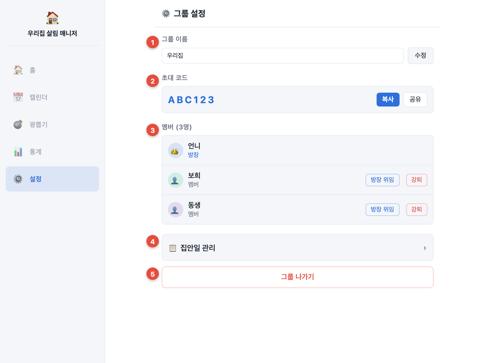

| # | Description |
|---|-------------|
| 1 | 그룹 이름 — 인라인 수정 |
| 2 | 초대 코드 — 6자 코드 확인·복사·공유(신규 멤버 합류용) |
| 3 | 멤버 목록 — 방장(👑)·멤버 구분, 방장에게 '방장 위임'·'강퇴' 노출 |
| 4 | 집안일 관리 진입 — 집안일 CRUD 화면으로 이동 |
| 5 | 그룹 나가기 — 본인 탈퇴(방장은 위임 후 가능) |

---

## 7. 기술 스택 및 시스템 구조

### 7.1 기술 스택

| 영역 | 기술 | 선택 이유 |
|------|------|-----------|
| 프론트엔드 | React + Next.js (App Router) | 컴포넌트 기반·라우팅·SSR 옵션, 상태 변화 중심 SPA |
| 스타일 | Tailwind CSS | 빠른 반응형 UI 구성 |
| 인증 | Firebase Auth | 이메일/비밀번호 인증, 별도 서버 불필요 |
| DB | Firebase Firestore | 실시간 동기화·NoSQL, 클라이언트 직접 연동 |
| 차트 | Recharts(또는 Chart.js) | 통계 막대/파이 차트 |
| 배포 | Vercel / Firebase Hosting | 정적 호스팅 + 자동 배포 |

### 7.2 시스템 구조 (3-Tier / 프론트엔드 중심)

```
┌─────────────────────────┐    ┌──────────────────────────┐    ┌─────────────────────┐
│   Presentation Tier      │    │   Application/Logic       │    │   Data Tier         │
│   (브라우저 / Client)     │    │   (클라이언트 내 로직 +    │    │   (Firebase)        │
│                          │    │    Firestore Rules)       │    │                     │
│ • Next.js + React        │◀──▶│ • 순번 진행/차례 복원      │◀──▶│ • Firestore         │
│ • Tailwind 반응형 UI      │SDK │ • 통계 집계 / 랜덤 배정     │SDK │   (users/groups/    │
│ • 상태관리(로그인·그룹)    │    │ • Security Rules 권한 검증 │    │    chores/choreLog) │
│ • PC 사이드바/모바일 탭    │    │ • API Route(검증 필요시만) │    │ • Firebase Auth     │
└─────────────────────────┘    └──────────────────────────┘    └─────────────────────┘
```

- **프론트엔드 중심 아키텍처**: 클라이언트가 Firestore SDK로 직접 읽기/쓰기. 서버 검증이 꼭 필요한 경우에만 Next.js API Route 사용.
- **접근 제어**: Firestore Security Rules로 "그룹 멤버만 해당 그룹 데이터 접근" 보장.

### 7.3 데이터 모델 (Firestore 4개 컬렉션)

| 컬렉션 | 핵심 필드 |
|--------|-----------|
| `users` | uid, name, email, groupIds[] |
| `groups` | name, inviteCode, ownerId, memberUids[] |
| `chores` | groupId, name, mode, color, rotationOrder[], currentTurnIndex, allowProxyComplete, fixedSchedule[], rules[] |
| `choreLog` | choreId, groupId, completedBy, completedByActual, completedAt, type, active, deactivateReason |

> 핵심 불변식: 순번 완료 시 `currentTurnIndex` +1(modulo) / 비활성화 시 차례 복원 / 통계는 `active=true`만 집계.

---

## 8. 개발 일정

전체 기간을 **3주** 집중 일정으로 구성한다(개인/2인 기준). 주차별로 세부 작업을 일 단위로 배분한다.

| 주차 | 단계 | 주요 작업 | 산출물 |
|------|------|-----------|--------|
| **1주차** | 기반 + 인증·그룹 | 스펙·화면 확정, Firebase/Firestore Rules·Next.js 셋업, 회원가입/로그인, 그룹 생성·초대·전환 | 레포·스키마, 인증·그룹 |
| **2주차** | 집안일 핵심 + 캘린더 | 집안일 CRUD·프리셋, 순번 완료 + 차례 이행, 고정제 스케줄, 캘린더 뷰·상세 팝업, 비활성화 + 차례 복원 | 홈·집안일 관리·캘린더 |
| **3주차** | 부가 기능 + 마감 | 통계·차트, 꽝뽑기 연출, 반응형 점검, 버그 수정, 배포, 발표 자료 | 배포본·발표 |

**주차별 세부 일정(예시)**

| 주차 | 전반 (1~3일) | 후반 (4~7일) |
|------|--------------|--------------|
| 1주차 | 프로젝트 셋업·Firestore 스키마·Rules | 인증(회원가입/로그인) + 그룹 관리 |
| 2주차 | 집안일 CRUD·순번 완료·고정제 | 캘린더·상세 팝업·비활성화/복원 |
| 3주차 | 통계·차트·꽝뽑기 | 반응형·배포·발표 준비 |

> **중간 점검**(1주차 말): 인증·그룹 기능 동작을 데모로 보고하고 진행률·방향성을 점검한다.

---

### 부록 · AI 활용 계획
설계 문서화, 화면설계서 작성, 컴포넌트/Firestore 연동 코드 생성, 디버깅에 Claude를 활용하며 활용 내역을 별도 기록으로 남긴다(강의 필수요건).
